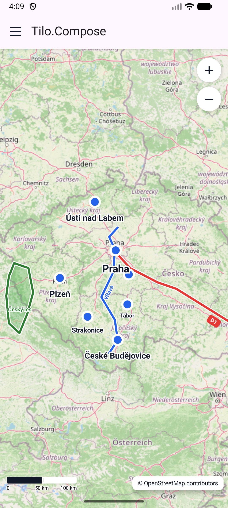
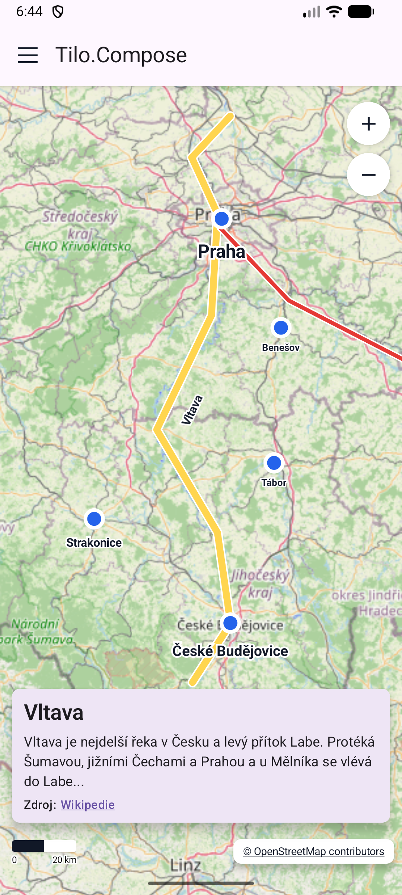
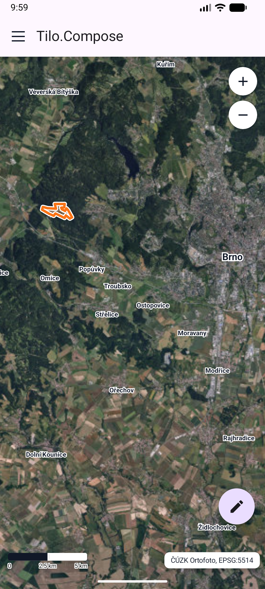
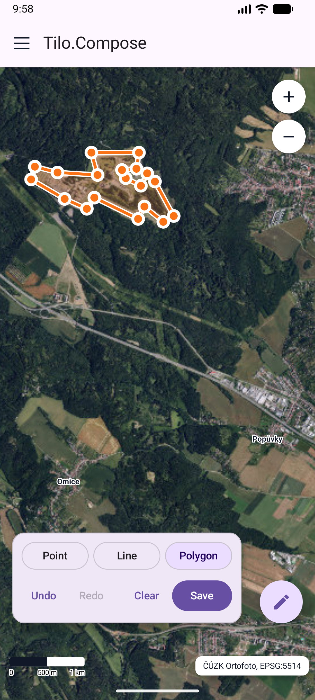

# Tilo.Compose

Compose-first Kotlin Multiplatform map toolkit.

Tilo.Compose is an early-stage map framework for Compose apps. It focuses on a
simple happy path for raster tiles, vector feature layers, labels, drawing, and
CRS-aware map state.

Unlike web-map-only toolkits, Tilo.Compose is designed for maps that need to
work in local and national coordinate reference systems, not only WGS84 or Web
Mercator. The current showcase uses Czech S-JTSK / Krovak (`EPSG:5514`) as a
first-class map projection.

> Work in progress: the project is still unstable and APIs may change before a
> public 1.0 release.

## Showcase

Current Android showcase app with XYZ raster tiles, vector styling, labels,
selection callouts, attribution, scale bar, and zoom controls.

<table>
  <tr>
    <td></td>
    <td></td>
  </tr>
  <tr>
    <td></td>
    <td></td>
  </tr>
</table>

## Quick Example

```kotlin
val cameraState = rememberMapCameraState(
    center = Point(-650_000.0, -1_100_000.0),
    zoom = 11.5,
    projection = sjtsk(),
)

val ortofoto = rememberWMSLayer(
    id = "cuzk-ortofoto",
    capabilitiesUrl = "https://ags.cuzk.gov.cz/arcgis1/services/ORTOFOTO/MapServer/WMSServer",
    layerName = "0",
    projection = sjtsk(),
    format = "image/jpeg",
)

val places = remember {
    features {
        point("brno", 16.6068, 49.1951) {
            label("Brno", style = largeLabelStyle())
            style = pointStyle {
                size = 14.dp
                fill(0xFF43A047)
                stroke(0xFF263238, width = 2.dp)
            }
        }
    }
}

TiloMap(
    cameraState = cameraState,
) {
    wmsTileLayer(ortofoto)

    featureLayer("places", places) {
        projection = wgs84()
        renderMode = cachedBitmap()
    }
}
```

See [DSL documentation](docs/dsl/README.md) for the current public API shape,
including map layers, raster sources, features, styles, labels, selection,
default UI overlays, drawing, tile grids, and projections.

## Roadmap to v1

The current codebase is a working MVP, but v1 is about making the API stable,
predictable, documented, and safe for other apps to adopt.

| Area | Status | v1 Target |
| --- | --- | --- |
| Compose-first map API | ✅ Done | `TiloMap`, `rememberMapCameraState`, layer DSL, projection helpers, and docs use the intended public API. |
| Raster WMS | ✅ Done | WMS layers load from GetCapabilities and render in the map CRS without client-side raster reprojection. |
| Raster XYZ | ✅ Done | Web Mercator XYZ layers are available through `xyzTileLayer(...)`; the showcase includes a Mercator/XYZ example. |
| Custom tile stores | ✅ Done | `tileStoreLayer(...)` supports app-owned z/x/y tile bytes with explicit projection and tile grid. |
| Raster MBTiles | 🟡 Planned | Add dedicated `mbTilesLayer(...)` with SQLite access, metadata resolution, TMS/XYZ row schemes, Web Mercator defaults, and S-JTSK/Krovak grids. |
| CRS model | ✅ Done | WGS84, Web Mercator, S-JTSK/Krovak, and identity projections have readable DSL helpers. |
| CRS transformations | 🟡 Partial | Keep transform contracts injectable and document how apps provide licensed or project-specific transform implementations. |
| Vector features | ✅ Done | Points, lines, polygons, multi-geometries, holes, labels, and common styles render from in-memory features. |
| Vector styling | ✅ Done | Layer-level point/line/polygon/label styles exist, with feature-level geometry and label overrides plus selected styles. |
| Vector performance | 🟡 Partial | Immediate and cached-bitmap render modes exist; v1 still needs batching by style/geometry and stronger diagnostics. |
| Spatial indexing | ✅ Done | In-memory feature sources can use `Tilo.SpatialIndex` for viewport queries. |
| Labels | ✅ Done | Label styles, presets, bitmap cache, line rotation, selected labels, priorities, and global collision handling are implemented. |
| Drawing plugin | ✅ Done | Drawing supports point/line/polygon drafts, undo/redo, custom controls, configurable style, and app-owned save callbacks. |
| Selection | ✅ Done | `onFeatureSelect`, multi-hit selection results, selected feature refs, and selected styles are available. |
| Editing plugin | ⬜ Planned | Build edit as a plugin on top of selection: vertex handles, move/insert/delete, save/cancel, and history. |
| Camera control | 🟡 Partial | Programmatic zoom helpers, animated zoom controls, and default zoom UI exist; v1 still needs fit bounds and rotation/bearing support. |
| Event routing | ⬜ Planned | Define gesture priority between overlays, draw, edit, selection, and default pan/zoom/rotate interactions. |
| Layer lifecycle | 🟡 Partial | Layer ordering and attribution metadata exist; v1 still needs visibility, min/max zoom, opacity, grouping, and dispose hooks. |
| Loading and errors | ⬜ Planned | Expose per-layer loading, tile failures, retry state, empty/offline state, and structured diagnostics. |
| Attribution | ✅ Done | Layers carry attribution metadata and the UI module provides a clickable default attribution overlay. |
| Default map UI | ✅ Done | Scale bar, attribution overlay, and zoom controls are available as optional content helpers. |
| Performance tooling | ⬜ Planned | Add an opt-in debug overlay for FPS, tile counts, cache stats, visible features, labels, projection, and bounds. |
| Testing strategy | 🟡 Partial | Unit tests and CI exist; v1 still needs fake tile providers, hit-test tests, tile-grid coverage, batching tests, and screenshots/goldens. |
| Accessibility | ⬜ Planned | Plan semantic descriptions, accessible default controls, keyboard interactions, and large edit/draw handles. |
| Documentation | 🟡 Partial | DSL docs exist; v1 needs polished guides for raster, vector, styling, labels, drawing, custom providers, transforms, and debugging. |
| Release readiness | ⬜ Planned | Define stable public packages, experimental/internal annotations, Maven coordinates, source/docs artifacts, changelog, and release workflow. |
| iOS validation | ⬜ Later | KMP targets exist, but production validation is intentionally focused on Android/JVM first. |
| Vector tiles | ⚪ Out of scope | v1 focuses on raster tiles and simple vector feature layers, not vector MBTiles or MVT rendering. |

See [API Roadmap](docs/API_ROADMAP.md) for the detailed v1 plan and open
design notes.

## License

MIT License. See [LICENSE](LICENSE).

GeoCore and SpatialIndex are also MIT licensed in their own repositories.
