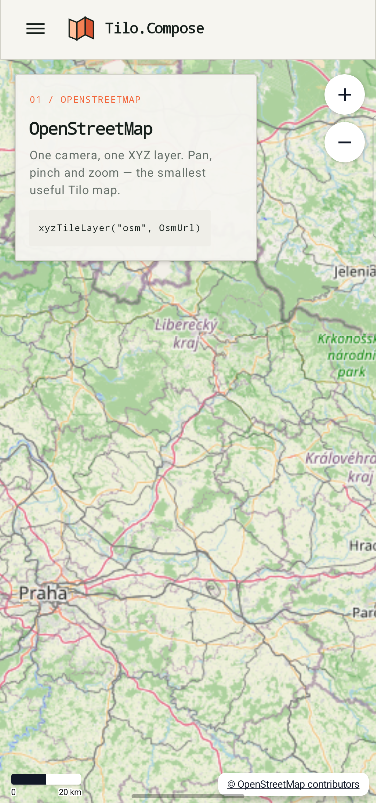
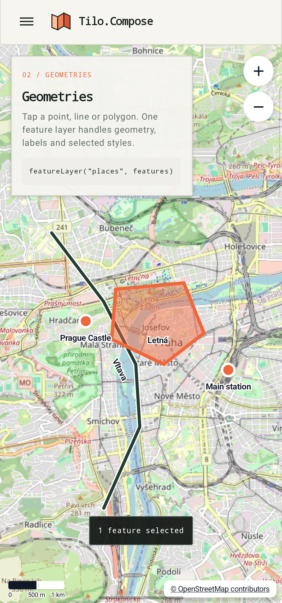
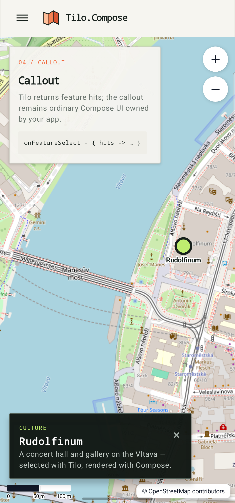
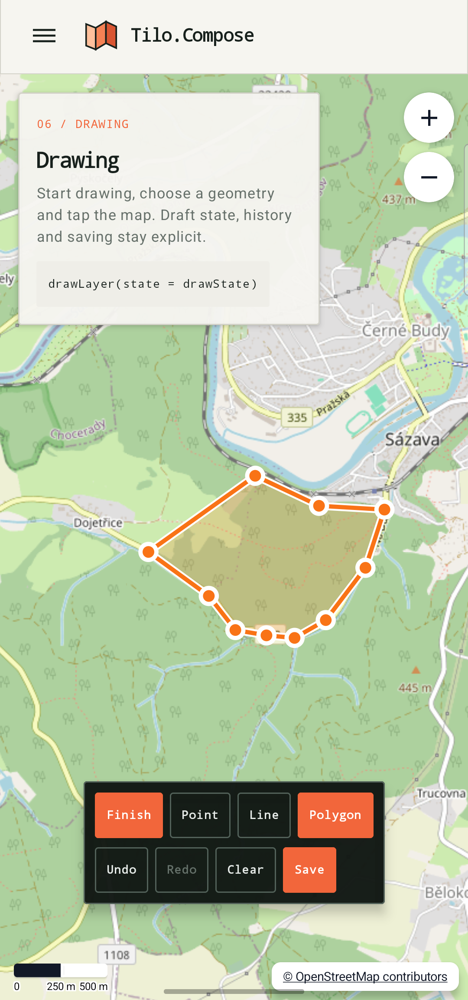
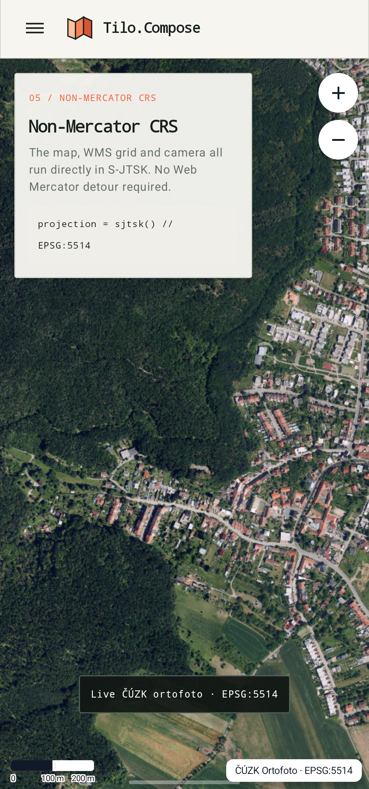

Compose-first Kotlin Multiplatform maps and GIS toolkit.

Tilo.Compose is an **open-source Kotlin Multiplatform toolkit** for building
modern **map and GIS applications with Compose**. It scales from a simple
OpenStreetMap view with a few markers to complex GIS workflows with multiple
coordinate systems.

The framework provides a **declarative Compose API**, tiled raster layers (WMS,
XYZ, and custom tile stores), **projection-aware rendering**, vector geometry
and styling, label placement, feature selection, interactive drawing, spatial
indexing, and extension points for custom data sources and coordinate
transformations.

> ⚠️ Tilo is currently in alpha. Public APIs may change before 1.0.

## Showcase

The `Tilo.Samples` Android app exercises the public API with real maps: a minimal
OpenStreetMap layer, feature selection and app-owned callouts, interactive
drawing, and live ČÚZK ortofoto rendered directly in S-JTSK (`EPSG:5514`).

<table width="100%">
  <tr>
    <td width="20%"></td>
    <td width="20%"></td>
    <td width="20%"></td>
    <td width="20%"></td>
    <td width="20%"></td>
  </tr>
</table>

## Installation

```kotlin
repositories {
    google()
    mavenCentral()
}

kotlin {
    sourceSets {
        commonMain.dependencies {
            implementation("eu.tilomaps:tilo-compose:0.1.2-alpha06")
            // Optional drawing plugin:
            implementation("eu.tilomaps:tilo-compose-draw:0.1.2-alpha06")
        }
    }
}
```

## Quick Example

```kotlin
@OptIn(ExperimentalTiloApi::class)
@Composable
fun MapScreen() {
    val brno = Point(16.6068, 49.1951)
    val cameraState = rememberMapCameraState(
        initialCenter = Wgs84ToEpsg5514Transformation.sourceToTarget(brno),
        initialZoom = 11.5,
        projection = sjtsk(),
        config = MapConfig.Default
            .withTransformation(Wgs84ToEpsg5514Transformation)
            .withTransformation(Epsg5514ToWgs84Transformation),
    )

    val places = remember {
        features {
            point("brno", brno) {
                label("Brno", style = largeLabelStyle())
                style = pointStyle {
                    size = 14.dp
                    fill(0xFF43A047)
                    stroke(0xFF263238, width = 2.dp)
                }
            }
        }
    }

    TiloMap(
        cameraState = cameraState,
        modifier = Modifier.fillMaxSize(),
    ) {
        wmsTileLayer(
            id = "cuzk-ortofoto",
            capabilitiesUrl = "https://ags.cuzk.gov.cz/arcgis1/services/ORTOFOTO/MapServer/WMSServer",
            layerName = "0",
            projection = sjtsk(),
            format = "image/jpeg",
        )

        featureLayer("places", places) {
            projection = wgs84()
            renderMode = cachedBitmap()
        }
    }
}
```

See the [web API reference](https://tilomaps.eu/reference.html) for the current
public API shape, including map layers, raster sources, features, styles,
labels, selection, default UI overlays, drawing, tile grids, and projections.

## Roadmap to v1

| Area | Status | v1 Target |
| --- | --- | --- |
| Compose-first map API | ✅ Done | `TiloMap`, `rememberMapCameraState`, the layer DSL, projection helpers, and public samples use the intended API. |
| Raster WMS | ✅ Done | Declarative capabilities loading, error reporting, axis-order handling, multiple WMS sublayers, and same-CRS rendering are implemented. |
| Raster XYZ | ✅ Done | `osmLayer(...)` provides the minimal OSM setup and `xyzTileLayer(...)` supports configurable XYZ/TMS grids and projections. |
| Custom tile stores | ✅ Done | `tileStoreLayer(...)` supports app-owned z/x/y tile bytes with explicit projection and tile grid. |
| Raster lifecycle | ✅ Done | Managed DSL runtimes survive recomposition and close on retirement/disposal; directly constructed raster layers are caller-owned `AutoCloseable` values and advanced DSL paths only borrow them. |
| CRS model | ✅ Done | WGS84, Web Mercator, S-JTSK/Krovak, and identity projections have readable DSL helpers. |
| Vector features | ✅ Done | Points, lines, polygons, multi-geometries, holes, labels, and common styles render from in-memory features. |
| Vector styling | ✅ Done | Layer-level point/line/polygon/label styles exist, with feature-level geometry and label overrides plus selected styles. |
| Spatial indexing | ✅ Done | In-memory feature sources can use `Tilo.SpatialIndex` for viewport queries. |
| Labels | ✅ Done | Label styles, presets, bitmap cache, line rotation, selected labels, priorities, and global collision handling are implemented. |
| Drawing plugin | ✅ Done | Drawing supports point/line/polygon drafts, undo/redo, custom controls, configurable style, and app-owned save callbacks. |
| Selection | ✅ Done | `onFeatureSelect`, multi-hit selection results, selected feature refs, and selected styles are available. |
| Attribution | ✅ Done | Layers carry attribution metadata and the UI module provides a clickable default attribution overlay. |
| Default map UI | ✅ Done | Scale bar, attribution overlay, zoom controls, and a north-reset compass are available as optional content helpers. |
| CRS transformations | ✅ Done | Android uses Proj4J; iOS bundles PROJ 9.8.1 with its database and basic resources embedded in the native library. |
| Layer controls | ✅ Done | Atomic nested groups, ordering, visibility, cascading opacity, min/max zoom, source identity, and attribution are implemented. |
| Camera control | ✅ Done | Programmatic and animated pan/zoom/rotation, focus-preserving gestures, default zoom/compass UI, and north-resetting `fitBounds` are implemented. |
| iOS validation | ✅ Done | Device and simulator targets compile, native PROJ transformations have runtime simulator tests, and CI runs the iOS simulator test suites plus a sample framework build. |
| Vector performance | 🟡 Partial | Immediate and cached-bitmap render modes exist; v1 still needs batching by style/geometry and stronger diagnostics. |
| Loading and errors | 🟡 Partial | WMS, XYZ/OSM, and tile-store declarations share observable initialization state, recoverable tile errors, and explicit retry; offline state and richer diagnostics remain. |
| Performance tooling | 🟡 Partial | The opt-in debug overlay reports zoom, FPS, frame times, and skipped frames; tile/cache/feature/label counters remain. |
| Testing strategy | 🟡 Partial | CI runs unit tests, quality gates, Android emulator pixel contracts, iOS simulator suites, and publication verification against a coordinate-only consumer; reusable screenshot/golden baselines and broader platform coverage remain. |
| Documentation | 🟡 Partial | The web Learn guide and API reference are published; broader public KDoc coverage and cross-module Dokka links remain. |
| API stability and adoption | 🟡 Partial | Renderer internals and experimental boundaries are established, with alpha compatibility notes published per release; a formal stability policy and wider adoption feedback remain. |
| Publication | 🟡 Partial | Six Maven artifacts share verified `eu.tilomaps` coordinates, metadata, sources/docs artifacts, signing support, and a consumer smoke test; release CI now verifies and uploads signed deployments, while the first live Central handoff and portal validation remain. |
| Raster MBTiles | ⬜ Planned | Add dedicated `mbTilesLayer(...)` with SQLite access, metadata resolution, TMS/XYZ row schemes, Web Mercator defaults, and S-JTSK/Krovak grids. |
| Editing plugin | ⬜ Planned | Build edit as a plugin on top of selection: vertex handles, move/insert/delete, save/cancel, and history. |
| Event routing | ⬜ Planned | Define gesture priority between overlays, draw, edit, selection, and default pan/zoom/rotate interactions. |
| Accessibility | ⬜ Planned | Plan semantic descriptions, accessible default controls, keyboard interactions, and large edit/draw handles. |
| ABI compatibility | ⬜ Planned | Generate the first reviewed baseline after the remaining API decisions, replace the skipped legacy check, and run the aggregate check in CI. |
| Vector tiles | ⚪ Out of scope | Applications can decode vector tiles into the existing feature and styling engine, but first-class MVT/vector-MBTiles support is not planned for v1 and performance at tile-scale feature counts remains a concern. |

## License

MIT License. See [LICENSE](LICENSE).

GeoCore and SpatialIndex are also MIT licensed in their own repositories.
The Android `core` artifact uses Proj4J and `proj4j-epsg`; the iOS artifact
bundles [PROJ](https://proj.org/). Both platform distributions include their
applicable software licenses and the full
[EPSG Dataset Terms of Use](https://epsg.org/terms-of-use.html). See
[third-party notices](THIRD_PARTY_NOTICES.md).
